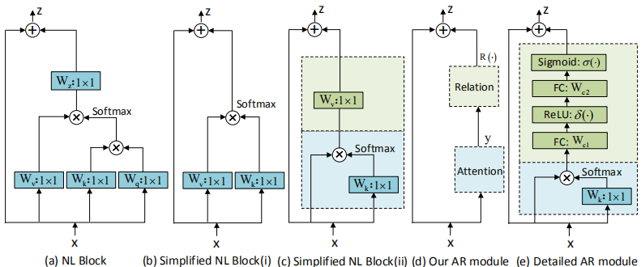

# Detecting Marine Organisms via Joint Attention-Relation Learning for Marine Video Surveillance
We release the code of our paper.

## Introduction

We propose a novel Attention-Relation (AR) module to explore joint Attention-Relation in CNNs for marine organism detection. We then design an Efficient Marine Organism Detector (EMOD) for high-resolution marine video surveillance to detect organisms and surveil marine environments in a real-time and fast fashion.

<div align="center">
  
</div>

<div align="center">
  
</div>

This code is based on the [mmdetection](https://github.com/open-mmlab/mmdetection) codebase. 

## Requirements

- Linux or macOS (Windows is in experimental support)
- Python 3.6+
- PyTorch 1.3+
- CUDA 9.2+ (If you build PyTorch from source, CUDA 9.0 is also compatible)
- GCC 5+
- MMCV

## Datasets

#### MOUSS, MBARI and HabCam
- Download the dataset and annotations from [dataset provider](https://20bn.com/datasets/something-something). 
- Download the *frame list* from the following links: ([train](https://drive.google.com/file/d/1GG9l8pNk1zBHqAlCGiNWbCqbcCdqwuQt/view?usp=sharing), [val](https://drive.google.com/file/d/1cNNnagoWqzo3GP30gOz0kFS49NqaO8Kh/view?usp=sharing)).
- Add prefix "folder_0" and rename all frame files, for example: 1/00001.jpg => 1/1_000001.jpg, 999/00001.jpg => 999/999_000001.jpg
- Put all annotation json files and the frame lists in the same folder, and set `DATA.PATH_TO_DATA_DIR` to the path. Set `DATA.PATH_PREFIX` to be the path to the folder containing extracted frames.

## Running

- To train and test a CoTeRe-ResNet-18 model from scratch on Something-Something V1. You can build variant CoTeRe-Nets via setting COTERE.TYPE.

  ```
  python tools/run_net.py \
    --cfg configs/SSv1/R3D_18_COTERE_32x1.yaml \
    DATA.PATH_TO_DATA_DIR path_to_frame_list \
    DATA.PATH_PREFIX path_to_frames \
    COTERE.TYPE CTSR
  ```
  You can also set the variables (DATA_PATH, FRAME_PATH, COTERE_TYPE) in [scripts/run_ssv1_r3d_18_32x1.sh](scripts/run_ssv1_r3d_18_32x1.sh), and then run the script.

  ```
  bash scripts/run_ssv1_r3d_18_32x1.sh
  ```

## Models
We will provide the models and results later.

## Acknowledgement
We really appreciate the contributors of following codebases.

- [facebookresearch/SlowFast](https://github.com/facebookresearch/SlowFast)
- [facebookresearch/VMZ](https://github.com/facebookresearch/VMZ)
- [kenshohara/3D-ResNets-PyTorch](https://github.com/kenshohara/3D-ResNets-PyTorch)
